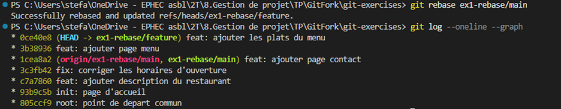
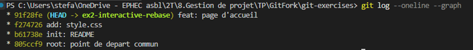
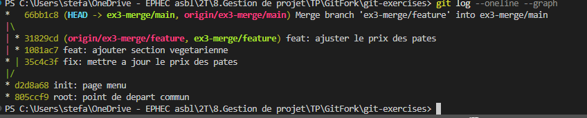
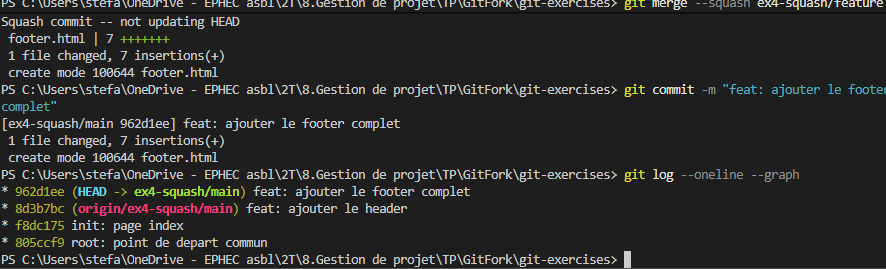

# Git Exercises — Le Git Gourmand

Bienvenue dans ce dépôt d'exercices Git !
Le contexte fictif : vous travaillez sur le site web du restaurant **Le Git Gourmand**.

## Comment démarrer

1. **Forkez** ce dépôt sur votre compte GitHub
2. **Clonez** votre fork en local : `git clone <url-de-votre-fork>`
3. Faites les exercices dans l'ordre que vous souhaitez (ils sont indépendants)
4. **Pushez** votre travail et envoyez-moi le lien de votre fork

---

## Exercice 1 — Rebase

**Branches :** `ex1-rebase/main` et `ex1-rebase/feature`

**Contexte :** La branche `ex1-rebase/feature` (nouvelle page menu) a divergé de
`ex1-rebase/main` avant que deux commits y soient ajoutés (horaires + contact).
L'historique n'est plus linéaire.

**Objectif :** Replacer `ex1-rebase/feature` au sommet de `ex1-rebase/main`.


**Résultat attendu :** L'historique de `ex1-rebase/feature` est linéaire ;
ses commits apparaissent *après* ceux de `ex1-rebase/main`.


---

## Exercice 2 — Rebase interactif

**Branche :** `ex2-interactive-rebase`

**Contexte :** L'historique de cette branche est chaotique : commits WIP,
doublons "FINAL / FINAL v2", corrections d'oublis en commits séparés.

**Objectif :** Nettoyer l'historique pour obtenir exactement **3 commits propres** :

| # | Message attendu |
|---|-----------------|
| 1 | `init: README` |
| 2 | `add: style.css` |
| 3 | `feat: page d'accueil` |


*Utilisez `squash`, `fixup` et `reword` dans l'éditeur interactif.*



---

## Exercice 3 — Merge avec conflit

**Branches :** `ex3-merge/main` et `ex3-merge/feature`

**Contexte :** Les deux branches ont modifié la même ligne dans `menu.html`
(le prix des pâtes carbonara) :
- `ex3-merge/main` → 16 EUR
- `ex3-merge/feature` → 15 EUR (+ ajout d'une section végétarienne)

**Objectif :** Merger `ex3-merge/feature` dans `ex3-merge/main` et résoudre le conflit.
Le chef a tranché : **le bon prix est 16 EUR**.

```bash
git checkout ex3-merge/main
git merge ex3-merge/feature
# Ouvrir menu.html, résoudre le conflit, garder 16 EUR
git add menu.html
git commit
```

---

## Exercice 4 — Squash

**Branches :** `ex4-squash/main` et `ex4-squash/feature`

**Contexte :** La branche `ex4-squash/feature` contient 5 commits WIP pour
l'ajout d'un footer. Il faut les intégrer dans main en un seul commit propre.

**Objectif :** Squasher tous les commits de `ex4-squash/feature` en un seul
avant de les intégrer.

```bash
...  TODO ...
git commit -m "feat: ajouter le footer complet"
```

---

## Exercice 5 — Cherry-pick

**Branches :** `ex5-cherrypick/main` et `ex5-cherrypick/feature`

**Contexte :** La branche `ex5-cherrypick/feature` contient 5 commits, mais
seuls **2 sont critiques** et doivent être appliqués sur `ex5-cherrypick/main` :

| Commit à récupérer | Pourquoi |
|--------------------|----------|
| `hotfix: corriger le lien de navigation casse` | Bug visible en prod |
| `fix: corriger la faille XSS dans le formulaire contact` | Faille de sécurité |

Les autres commits (page "à propos", mode sombre expérimental, refacto WIP)
ne doivent **pas** être mergés.

**Objectif :**

```bash
# 1. Trouver les hashes des deux commits
git log --oneline ex5-cherrypick/feature

# 2. Cherry-picker les deux commits sur main
git checkout ex5-cherrypick/main
git cherry-pick <hash-du-hotfix>
git cherry-pick <hash-du-fix-xss>
```

---

## Récapitulatif des branches

| Branche | Exercice | Rôle |
|---------|----------|------|
| `ex1-rebase/main` | Rebase | Branch cible |
| `ex1-rebase/feature` | Rebase | Branch à rebaser |
| `ex2-interactive-rebase` | Rebase interactif | Historique à nettoyer |
| `ex3-merge/main` | Merge | Branch cible |
| `ex3-merge/feature` | Merge | Branch à merger (conflit!) |
| `ex4-squash/main` | Squash | Branch cible |
| `ex4-squash/feature` | Squash | Branch à squasher |
| `ex5-cherrypick/main` | Cherry-pick | Branch cible |
| `ex5-cherrypick/feature` | Cherry-pick | Source des commits |

